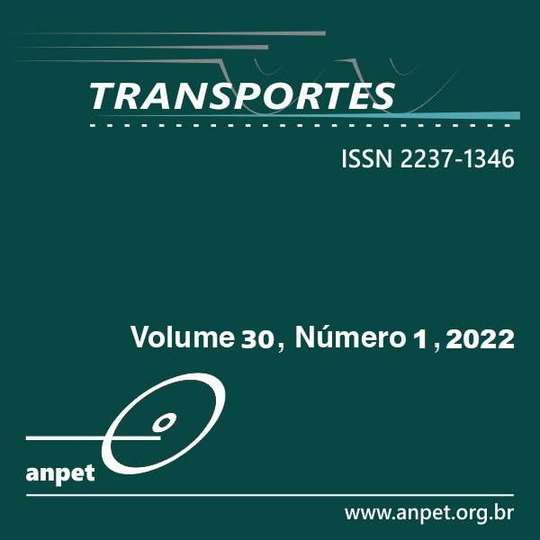

# Factors affecting older adults walkability in Brazil: a multilevel approach
R script for the paper: Fatores que afetam a caminhabilidade de adultos mais velhos em áreas urbanas brasileiras: uma abordagem multinível. v 30, n. 1, Revista Transportes.

The paper is originally published in portuguese, and you can download it [here](https://www.revistatransportes.org.br/anpet/article/view/2657/973).

Case you use the code or the paper in you research, please cite it!
